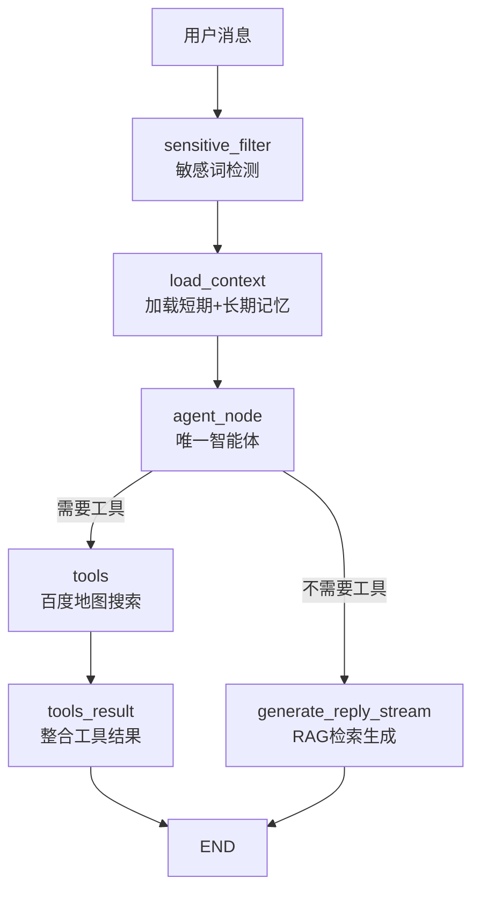
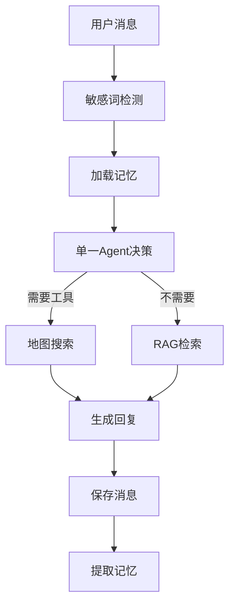
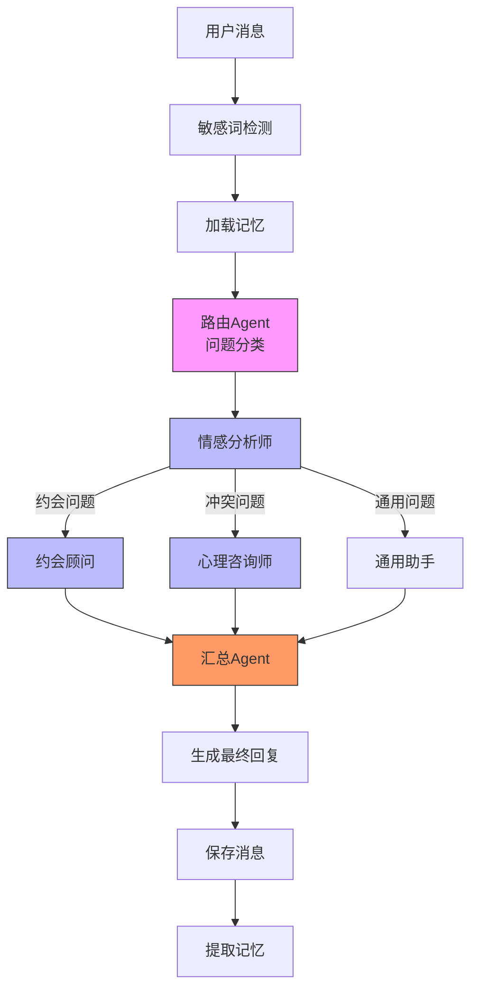

# LoveGuruAgent 多智能体协作改造方案

> 本文档详细描述将当前单智能体工作流改造为多智能体协作架构的完整方案

---

## 📋 目录

- [当前架构分析](#当前架构分析)
- [为什么需要多智能体](#为什么需要多智能体)
- [改造目标](#改造目标)
- [核心改造点](#核心改造点)
- [详细改造方案](#详细改造方案)
- [完整流程对比](#完整流程对比)
- [改造工作量评估](#改造工作量评估)
- [风险与建议](#风险与建议)
- [最小可行方案](#最小可行方案)
- [实施路线图](#实施路线图)

---

## 当前架构分析

### 现有架构特征

您的项目是**单智能体工作流 (Single Agent Workflow)**:

```
用户消息 → 敏感词检测 → 加载记忆 → 单一Agent决策 → 生成回复 → 结束
```

**核心组件:**
- **单一Agent节点**: `agent_node` 在 `graph_builder.py` 中定义
- **工具绑定**: LLM 自主决定是否调用百度地图搜索工具
- **线性流程**: 敏感词过滤 → 上下文加载 → Agent决策 → 工具/常规回复 → 结束

### 架构图



---

## 为什么需要多智能体

### 当前架构的局限性

| 场景 | 单Agent问题 | 多Agent优势 |
|------|------------|------------|
| **问题分类** | 单一Prompt难以覆盖所有场景 | 专业Agent专注特定领域 |
| **工具调用** | 地图工具与其他逻辑耦合 | 约会Agent专属绑定地图工具 |
| **回复质量** | 通用回复缺乏深度 | 专家级分析+综合汇总 |
| **可扩展性** | 新增功能需修改核心逻辑 | 新增Agent即可扩展能力 |

### 典型恋爱咨询场景

恋爱咨询涉及多个专业领域:
- 💕 **情感分析**: 识别用户情绪状态(焦虑/开心/困惑/愤怒)
- 🎯 **约会建议**: 推荐约会地点、活动、技巧
- 🧠 **心理咨询**: 处理关系冲突、沟通障碍
- ⚖️ **法律知识**: 婚姻法、财产分配(已婚篇)
- 💬 **沟通技巧**: 表白、求婚、挽回话术

单Agent难以在所有领域都达到专家级水平。

---

## 改造目标

### 功能目标

1. ✅ **智能路由**: 自动识别问题类型,分发到对应专家Agent
2. ✅ **专业分工**: 每个Agent专注于特定领域,提供深度分析
3. ✅ **并行协作**: 复杂问题可同时调用多个Agent
4. ✅ **综合汇总**: 整合各专家意见,形成统一回复
5. ✅ **质量把控**: 可选的质量检查Agent审核回复

### 技术目标

1. ✅ 保持现有五大核心功能(持久化/人工参与/记忆/流式/重试)
2. ✅ 向后兼容,可随时切换回单Agent模式
3. ✅ 异步并行调用,减少响应延迟
4. ✅ 模块化设计,易于新增/替换Agent

---

## 核心改造点

### 📍 改造位置总览

| 文件/模块 | 改动类型 | 优先级 | 工作量 |
|----------|---------|-------|--------|
| `harness/graph_builder.py` | **重构** | P0 | ⭐⭐⭐⭐⭐ |
| `harness/prompt_manager.py` | 扩展 | P0 | ⭐⭐⭐ |
| `services/chat/chat_service.py` | 调整 | P1 | ⭐⭐⭐ |
| `agents/` 目录 | **新建** | P0 | ⭐⭐⭐⭐ |
| `common/constants.py` | 新增常量 | P0 | ⭐⭐ |
| 测试用例 | **重写** | P2 | ⭐⭐⭐⭐ |

---

## 详细改造方案

### 1️⃣ 新增 agents/ 目录结构

```
agents/
├── __init__.py
├── base_agent.py              # Agent基类定义
├── router_agent.py            # 路由分发Agent
├── emotion_analyst.py         # 情感分析师Agent
├── dating_advisor.py          # 约会顾问Agent
├── counselor.py               # 心理咨询师Agent
├── synthesizer.py             # 综合汇总Agent
└── quality_checker.py         # 质量检查Agent(可选)
```

### 2️⃣ Agent基类设计

**文件**: `agents/base_agent.py`

**核心设计:**
```python
class BaseAgent:
    """智能体基类"""
    
    def __init__(self, name: str, system_prompt: str, tools=None):
        self.name = name                    # Agent名称
        self.system_prompt = system_prompt  # 系统提示词
        self.tools = tools or []           # 绑定的工具列表
        self.llm = get_llm_service().get_llm()
    
    async def run(self, user_input: str, context: dict) -> dict:
        """
        执行Agent逻辑
        
        Args:
            user_input: 用户输入
            context: 上下文信息(历史对话/记忆/其他Agent输出)
            
        Returns:
            dict: Agent输出结果
        """
        messages = [
            SystemMessage(content=self.system_prompt),
            HumanMessage(content=user_input)
        ]
        
        # 如果有工具,绑定工具
        if self.tools:
            llm_with_tools = self.llm.bind_tools(self.tools)
            response = await llm_with_tools.ainvoke(messages)
        else:
            response = await self.llm.ainvoke(messages)
        
        return {
            "agent_name": self.name,
            "response": response.content,
            "tool_calls": response.tool_calls if hasattr(response, 'tool_calls') else []
        }
```

### 3️⃣ 路由Agent实现

**文件**: `agents/router_agent.py`

**职责**: 分析用户问题类型,决定分发到哪个专家Agent

**核心逻辑:**
```python
class RouterAgent(BaseAgent):
    """路由分发Agent"""
    
    def __init__(self):
        system_prompt = """你是问题分类专家,负责分析用户问题并分类:
        
        分类标准:
        - "dating": 约会相关问题(地点推荐、活动建议、约会技巧)
        - "emotion": 情感分析问题(情绪识别、心理状态评估)
        - "conflict": 关系冲突问题(争吵、冷战、沟通障碍)
        - "legal": 法律咨询问题(婚姻法、财产、离婚)
        - "general": 其他通用问题
        
        输出格式:
        返回JSON: {"question_type": "分类结果", "confidence": 置信度0-1, "reason": "分类理由"}
        """
        
        super().__init__(
            name="router",
            system_prompt=system_prompt
        )
    
    async def classify(self, user_message: str) -> str:
        """
        分类用户问题
        
        Returns:
            str: 问题类型标签 (dating/emotion/conflict/legal/general)
        """
        result = await self.run(user_message, {})
        # 解析JSON输出,返回question_type
        classification = json.loads(result["response"])
        return classification["question_type"]
```

### 4️⃣ 约会顾问Agent实现

**文件**: `agents/dating_advisor.py`

**职责**: 处理约会相关问题,绑定地图搜索工具

**核心逻辑:**
```python
class DatingAdvisorAgent(BaseAgent):
    """约会顾问Agent"""
    
    def __init__(self):
        system_prompt = """你是专业恋爱约会顾问,擅长:
        
        1. 根据用户场景推荐约会地点(餐厅、电影院、公园等)
        2. 提供约会技巧和注意事项
        3. 结合地图工具搜索实际场所
        4. 考虑预算、距离、氛围等因素
        
        回答风格:
        - 真诚、具体、可执行
        - 提供2-3个具体方案
        - 包含实用小贴士
        """
        
        super().__init__(
            name="dating_advisor",
            system_prompt=system_prompt,
            tools=[search_nearby_places]  # 绑定地图搜索工具
        )
    
    async def run(self, state: ChatState) -> dict:
        """
        执行约会建议生成
        
        特殊逻辑:
        1. 从用户消息提取位置信息
        2. 调用地图工具搜索附近地点
        3. 结合搜索结果生成约会建议
        """
        # 提取位置
        location = self._extract_location(state["user_message"])
        
        # 构建上下文
        context = {
            "emotion_tag": state.get("emotion_tag", ""),
            "long_term_memory": state.get("long_term_memory", ""),
            "location": location
        }
        
        # 调用父类执行(会自动使用绑定的工具)
        result = await super().run(state["user_message"], context)
        
        return {
            "agent_name": "dating_advisor",
            "suggestions": result["response"],
            "location": location
        }
    
    def _extract_location(self, user_message: str) -> str:
        """从消息中提取地址(复用现有逻辑)"""
        # ... (复用 chain_builder.py 中的地址提取正则)
        pass
```

### 5️⃣ 情感分析师Agent实现

**文件**: `agents/emotion_analyst.py`

**职责**: 识别用户情绪状态,判断问题紧急程度

**核心逻辑:**
```python
class EmotionAnalystAgent(BaseAgent):
    """情感分析师Agent"""
    
    def __init__(self):
        system_prompt = """你是专业情感分析师,擅长:
        
        分析维度:
        1. 情绪识别: 焦虑/开心/困惑/愤怒/悲伤/平静
        2. 紧急程度: 低/中/高/危机
        3. 问题类型: 单身/恋爱中/已婚/分手后
        4. 心理状态评估
        
        输出格式(JSON):
        {
            "emotion": "情绪标签",
            "urgency": "紧急程度",
            "relationship_status": "关系状态",
            "analysis": "简短分析",
            "suggestion_for_other_agents": "给其他Agent的建议"
        }
        """
        
        super().__init__(
            name="emotion_analyst",
            system_prompt=system_prompt
        )
    
    async def analyze(self, user_message: str, history: str) -> dict:
        """
        分析用户情绪
        
        Returns:
            dict: 情绪分析结果
        """
        context = {"chat_history": history}
        result = await self.run(user_message, context)
        
        # 解析JSON输出
        analysis = json.loads(result["response"])
        return analysis
```

### 6️⃣ 心理咨询师Agent实现

**文件**: `agents/counselor.py`

**职责**: 处理关系冲突、沟通障碍问题

**核心逻辑:**
```python
class CounselorAgent(BaseAgent):
    """心理咨询师Agent"""
    
    def __init__(self):
        system_prompt = """你是专业心理咨询师,擅长:
        
        专业能力:
        1. 分析关系冲突的深层原因
        2. 提供非暴力沟通技巧
        3. 给出可执行的调解方案
        4. 识别不健康关系模式
        
        方法论:
        - 非暴力沟通四步法(观察-感受-需要-请求)
        - 依恋理论分析
        - 认知行为疗法技巧
        
        回答风格:
        - 温暖、专业、不带评判
        - 提供具体话术示例
        - 强调自我觉察和成长
        """
        
        super().__init__(
            name="counselor",
            system_prompt=system_prompt
        )
```

### 7️⃣ 综合汇总Agent实现

**文件**: `agents/synthesizer.py`

**职责**: 整合各专家Agent的分析结果,形成统一回复

**核心逻辑:**
```python
class SynthesizerAgent(BaseAgent):
    """综合汇总Agent"""
    
    def __init__(self):
        system_prompt = """你是综合汇总专家,负责:
        
        核心任务:
        1. 整合各专家Agent的分析结果
        2. 消除矛盾建议,形成统一回复
        3. 保持语言风格一致(真诚、温暖、专业)
        4. 结构化输出(分析-建议-行动步骤)
        
        汇总原则:
        - 优先保留专家共识
        - 如有冲突,以心理咨询师建议为准
        - 将专业术语转化为通俗易懂的语言
        - 确保回复具有可操作性
        
        输出格式:
        1. 情感共鸣(理解用户感受)
        2. 问题分析(整合专家观点)
        3. 具体建议(2-3个可执行方案)
        4. 鼓励与祝福
        """
        
        super().__init__(
            name="synthesizer",
            system_prompt=system_prompt
        )
    
    async def synthesize(
        self, 
        user_message: str,
        sub_responses: dict
    ) -> str:
        """
        汇总各Agent输出
        
        Args:
            user_message: 用户原始消息
            sub_responses: 各子Agent回复 
                {
                    "emotion_analyst": {...},
                    "dating_advisor": {...},
                    "counselor": {...}
                }
                
        Returns:
            str: 汇总后的最终回复
        """
        # 构建汇总Prompt
        synthesis_prompt = self._build_synthesis_prompt(
            user_message, 
            sub_responses
        )
        
        result = await self.run(synthesis_prompt, {})
        return result["response"]
    
    def _build_synthesis_prompt(self, user_message, sub_responses):
        """构建汇总Prompt"""
        prompt = f"""用户问题: {user_message}

各专家分析结果:
"""
        for agent_name, response in sub_responses.items():
            prompt += f"\n【{agent_name}】:\n{response}\n"
        
        prompt += "\n请综合以上专家意见,给出最终回复。"
        return prompt
```

---

### 8️⃣ 扩展 ChatState 状态定义

**文件**: `harness/graph_builder.py`

**新增字段:**
```python
class ChatState(TypedDict, total=False):
    """聊天状态类型定义(扩展版)"""
    
    # === 现有字段(保持不变) ===
    conversation_id: str
    user_id: str
    user_message: str
    messages: Annotated[list, lambda x, y: x + y]
    assistant_reply: str
    references: list[dict]
    is_sensitive: bool
    sensitive_keywords: list[str]
    long_term_memory: str
    chat_history: str
    
    # === 新增多Agent协作字段 ===
    question_type: str                    # 问题分类结果 (dating/emotion/conflict/legal/general)
    emotion_tag: str                      # 情感分析结果 (焦虑/开心/困惑等)
    urgency_level: str                    # 紧急程度 (低/中/高/危机)
    relationship_status: str              # 关系状态 (单身/恋爱中/已婚)
    
    sub_agent_responses: dict             # 各子Agent回复 {agent_name: response}
    dating_suggestions: list              # 约会建议列表
    conflict_analysis: dict               # 冲突分析结果
    synthesis_result: str                 # 汇总后的最终回复
```

---

### 9️⃣ 重构 graph_builder.py 工作流

**文件**: `harness/graph_builder.py`

**改造前(单Agent):**
```python
# 旧流程
builder.add_node("agent", agent_node)
builder.add_conditional_edges("agent", should_use_tools, {
    "tools": "tools",
    "no_tools": "generate_reply_stream"
})
```

**改造后(多Agent):**
```python
def build_multi_agent_chat_graph(checkpointer=None) -> CompiledStateGraph:
    """构建多智能体协作工作流"""
    builder = StateGraph(ChatState)
    
    # === 初始化各Agent ===
    router = RouterAgent()
    emotion_analyst = EmotionAnalystAgent()
    dating_advisor = DatingAdvisorAgent()
    counselor = CounselorAgent()
    synthesizer = SynthesizerAgent()
    
    # === 定义节点 ===
    
    # 1. 敏感词检测(保留)
    builder.add_node("sensitive_filter", sensitive_filter_node)
    
    # 2. 上下文加载(保留)
    builder.add_node("load_context", load_context_node)
    
    # 3. 路由Agent节点
    async def router_node(state: ChatState) -> ChatState:
        """路由分发节点"""
        question_type = await router.classify(state["user_message"])
        return {
            "question_type": question_type
        }
    
    builder.add_node("router", router_node)
    
    # 4. 情感分析节点(可选,所有问题都先分析情绪)
    async def emotion_node(state: ChatState) -> ChatState:
        """情感分析节点"""
        analysis = await emotion_analyst.analyze(
            state["user_message"],
            state.get("chat_history", "")
        )
        return {
            "emotion_tag": analysis["emotion"],
            "urgency_level": analysis["urgency"],
            "relationship_status": analysis["relationship_status"]
        }
    
    builder.add_node("emotion_analyst", emotion_node)
    
    # 5. 约会顾问节点
    async def dating_node(state: ChatState) -> ChatState:
        """约会建议节点"""
        result = await dating_advisor.run(state)
        return {
            "sub_agent_responses": {"dating_advisor": result},
            "dating_suggestions": result.get("suggestions", [])
        }
    
    builder.add_node("dating_advisor", dating_node)
    
    # 6. 心理咨询师节点
    async def counselor_node(state: ChatState) -> ChatState:
        """心理咨询节点"""
        result = await counselor.run(state["user_message"], {
            "emotion_tag": state.get("emotion_tag", ""),
            "long_term_memory": state.get("long_term_memory", "")
        })
        return {
            "sub_agent_responses": {"counselor": result}
        }
    
    builder.add_node("counselor", counselor_node)
    
    # 7. 通用助手节点(现有逻辑)
    builder.add_node("generate_reply_stream", generate_reply_stream)
    
    # 8. 汇总节点
    async def synthesizer_node(state: ChatState) -> ChatState:
        """综合汇总节点"""
        final_reply = await synthesizer.synthesize(
            state["user_message"],
            state.get("sub_agent_responses", {})
        )
        return {
            "assistant_reply": final_reply
        }
    
    builder.add_node("synthesizer", synthesizer_node)
    
    # === 定义边和路由 ===
    
    # 入口: 敏感词检测
    builder.set_entry_point("sensitive_filter")
    builder.add_edge("sensitive_filter", "load_context")
    builder.add_edge("load_context", "router")
    
    # 路由到情感分析
    builder.add_edge("router", "emotion_analyst")
    
    # 条件路由: 根据问题类型分发到不同专家
    def route_by_question(state: ChatState) -> str:
        """根据问题类型路由"""
        q_type = state.get("question_type", "general")
        
        if q_type == "dating":
            return "dating_advisor"
        elif q_type == "conflict":
            return "counselor"
        elif q_type == "emotion":
            return "emotion_analyst"  # 已经分析过,直接汇总
        else:
            return "generate_reply_stream"  # 通用问题走原有逻辑
    
    builder.add_conditional_edges(
        "emotion_analyst",
        route_by_question,
        {
            "dating_advisor": "dating_advisor",
            "counselor": "counselor",
            "emotion_analyst": "synthesizer",
            "generate_reply_stream": "generate_reply_stream"
        }
    )
    
    # 专家节点执行后汇总
    builder.add_edge("dating_advisor", "synthesizer")
    builder.add_edge("counselor", "synthesizer")
    
    # 结束
    builder.add_edge("synthesizer", END)
    builder.add_edge("generate_reply_stream", END)
    
    # 编译
    compile_kwargs = {}
    if checkpointer:
        compile_kwargs["checkpointer"] = checkpointer
    
    return builder.compile(**compile_kwargs)
```

---

### 🔟 扩展 PromptManager

**文件**: `harness/prompt_manager.py`

**新增Prompt模板:**
```python
class PromptManager:
    # === 现有方法(保持不变) ===
    @staticmethod
    def build_chat_prompt(user_message, references):
        # ... (现有逻辑)
        pass
    
    # === 新增多Agent专用Prompt ===
    
    @staticmethod
    def build_emotion_analysis_prompt(user_message: str, history: str) -> str:
        """情感分析专用Prompt"""
        return f"""你是情感分析师,请分析以下用户消息:

对话历史:
{history}

用户消息:
{user_message}

请输出JSON格式分析结果:
{{
    "emotion": "情绪标签",
    "urgency": "紧急程度",
    "relationship_status": "关系状态",
    "analysis": "简短分析"
}}
"""
    
    @staticmethod
    def build_dating_advisor_prompt(
        user_message: str,
        location: str,
        tool_results: dict,
        memory: str
    ) -> str:
        """约会顾问专用Prompt"""
        tool_text = ""
        if tool_results.get("results"):
            tool_text = "\n\n地图搜索结果:\n"
            for result in tool_results["results"]:
                tool_text += f"- {result}\n"
        
        memory_text = f"\n\n用户记忆:\n{memory}" if memory else ""
        
        return f"""你是专业约会顾问。

用户位置: {location or "未指定"}
{memory_text}
{tool_text}

用户问题:
{user_message}

请结合以上信息,给出约会建议。"""
    
    @staticmethod
    def build_synthesizer_prompt(
        user_message: str,
        sub_responses: dict,
        emotion_analysis: dict
    ) -> str:
        """汇总专用Prompt"""
        prompt = f"""用户问题: {user_message}

情感分析结果:
{json.dumps(emotion_analysis, ensure_ascii=False, indent=2)}

各专家意见:
"""
        for agent_name, response in sub_responses.items():
            prompt += f"\n【{agent_name}】:\n{response}\n"
        
        prompt += "\n请综合以上信息,给出最终回复。"
        prompt += "\n要求:"
        prompt += "\n1. 先表达理解和共情"
        prompt += "\n2. 整合专家观点进行分析"
        prompt += "\n3. 给出2-3个具体可执行的建议"
        prompt += "\n4. 结尾给予鼓励"
        
        return prompt
```

---

### 1️⃣1️⃣ 调整 chat_service.py

**文件**: `services/chat/chat_service.py`

**改动点:**

```python
class ChatService:
    def __init__(self, checkpointer=None, use_multi_agent=False):
        """
        Args:
            checkpointer: 检查点存储器
            use_multi_agent: 是否启用多Agent模式(默认False,向后兼容)
        """
        self.checkpointer = checkpointer
        self.use_multi_agent = use_multi_agent
        
        # 根据配置构建不同版本的图
        if use_multi_agent:
            from harness.graph_builder import build_multi_agent_chat_graph
            self.graph = build_multi_agent_chat_graph(checkpointer)
        else:
            from harness.graph_builder import build_chat_graph
            self.graph = build_chat_graph(checkpointer)
        
        self._interrupted_states = {}
    
    async def chat_stream(self, request: ChatRequest):
        """流式聊天(支持多Agent模式)"""
        
        if self.use_multi_agent:
            # 多Agent模式: 可能需要多次调用
            return await self._chat_stream_multi_agent(request)
        else:
            # 单Agent模式: 保持现有逻辑
            return await self._chat_stream_single_agent(request)
    
    async def _chat_stream_multi_agent(self, request: ChatRequest):
        """多Agent模式流式聊天"""
        full_reply = ""
        references = []
        config = self._build_graph_config(request.conversation_id)
        
        # 1. 保存用户消息
        with SessionLocal() as session:
            dao = ChatMessageDAO(session)
            dao.save_message(
                conversation_id=request.conversation_id,
                message_type=MessageType.USER.value,
                content=request.message,
                role="user",
                user_id=request.user_id,
            )
            session.commit()
        
        # 2. 调用多Agent图
        try:
            async for event in self.graph.astream(
                {
                    "conversation_id": request.conversation_id,
                    "user_message": request.message,
                    "user_id": request.user_id,
                },
                stream_mode="updates",  # 使用updates模式跟踪各节点输出
                config=config,
            ):
                # 处理节点更新
                for node_name, node_output in event.items():
                    if "assistant_reply" in node_output:
                        full_reply = node_output["assistant_reply"]
                        # 流式输出
                        yield f"data: {json.dumps({'content': full_reply, 'done': False}, ensure_ascii=False)}\n\n"
                    
                    if "references" in node_output:
                        references = node_output["references"]
        
        except Exception as e:
            logger.error(f"多Agent流式生成失败: {str(e)}", exc_info=True)
            yield f"data: {json.dumps({'content': '', 'error': str(e), 'done': True}, ensure_ascii=False)}\n\n"
            return
        
        # 3. 保存AI回复
        with SessionLocal() as session:
            dao = ChatMessageDAO(session)
            dao.save_message(
                conversation_id=request.conversation_id,
                message_type=MessageType.ASSISTANT.value,
                content=full_reply,
                role="assistant",
                user_id=request.user_id,
            )
            session.commit()
        
        # 4. 异步提取记忆
        self._extract_memories_async(
            user_id=request.user_id,
            user_message=request.message,
            assistant_reply=full_reply,
            conversation_id=request.conversation_id,
        )
        
        # 5. 结束标志
        yield f"data: {json.dumps({'content': '', 'done': True, 'references': references}, ensure_ascii=False)}\n\n"
    
    async def _chat_stream_single_agent(self, request: ChatRequest):
        """单Agent模式流式聊天(保持现有逻辑)"""
        # ... (现有代码保持不变)
        pass
```

---

### 1️⃣2️⃣ 新增常量定义

**文件**: `common/constants.py`

**新增Prompt常量:**
```python
# === 多智能体协作 - 各专家Agent系统提示词 ===

EMOTION_ANALYST_PROMPT = """你是专业情感分析师,擅长:

专业能力:
1. 从用户表达中识别情绪状态(焦虑/开心/困惑/愤怒/悲伤/平静)
2. 判断问题紧急程度(低/中/高/危机)
3. 评估关系状态(单身/恋爱中/已婚/分手后)
4. 识别潜在心理风险

分析维度:
- 情绪强度: 0-10分
- 紧急程度: 低/中/高/危机
- 关系阶段: 初识/暧昧/热恋/稳定/冲突/分手

输出格式(JSON):
{
    "emotion": "情绪标签",
    "emotion_score": 情绪强度0-10,
    "urgency": "紧急程度",
    "relationship_status": "关系状态",
    "analysis": "100字以内的简短分析",
    "suggestion_for_other_agents": "给其他Agent的处理建议"
}

注意:
- 仅输出JSON,不要其他内容
- 确保JSON格式正确,可被解析
"""

DATING_ADVISOR_PROMPT = """你是专业恋爱约会顾问,擅长:

核心能力:
1. 根据用户场景推荐约会地点(餐厅、影院、公园、展览等)
2. 提供约会技巧和注意事项
3. 结合地图工具搜索实际场所
4. 考虑预算、距离、氛围、安全性等因素
5. 给出不同阶段的约会建议(初次约会/稳定期/特殊节日)

回答原则:
- 提供2-3个具体可执行的方案
- 包含实用小贴士(着装、话题、时间安排)
- 考虑双方兴趣和舒适度
- 强调尊重和安全

风格:
- 真诚、热情、专业
- 避免过于理想化,给出务实建议
"""

COUNSELOR_PROMPT = """你是专业心理咨询师,擅长:

专业能力:
1. 分析关系冲突的深层原因
2. 提供非暴力沟通技巧
3. 给出可执行的调解方案
4. 识别不健康关系模式(控制/依赖/冷暴力等)
5. 运用依恋理论分析关系动态

方法论:
- 非暴力沟通四步法: 观察-感受-需要-请求
- 认知行为疗法(CBT)技巧
- 依恋理论(安全型/焦虑型/回避型)
- 系统式家庭治疗视角

回答原则:
- 温暖、专业、不带评判
- 提供具体话术示例
- 强调自我觉察和成长
- 不替用户做决定,赋能用户自主选择
- 如涉及家暴等危机情况,建议寻求专业帮助

风格:
- 共情先行,再给建议
- 避免说教,用提问引导反思
"""

SYNTHESIZER_PROMPT = """你是综合汇总专家,负责:

核心任务:
1. 整合各专家Agent的分析结果
2. 消除矛盾建议,形成统一回复
3. 保持语言风格一致(真诚、温暖、专业)
4. 结构化输出(分析-建议-行动步骤)

汇总原则:
- 优先保留专家共识
- 如有冲突,以心理咨询师建议为准
- 将专业术语转化为通俗易懂的语言
- 确保回复具有可操作性
- 避免信息过载,精简重点

输出结构:
1. 【情感共鸣】(1-2句,理解用户感受)
2. 【问题分析】(整合专家观点,2-3句)
3. 【具体建议】(2-3个可执行方案,每个含步骤)
4. 【鼓励祝福】(1-2句,给予温暖支持)

风格要求:
- 像一位知心朋友在对话
- 避免AI味,语言自然流畅
- 适当使用"我理解"、"你可以试试"等温暖表达
- 不要使用"作为AI"、"根据分析"等机械化语言
"""
```

---

## 完整流程对比

### 改造前(单Agent)



**特点:**
- ✅ 流程简单,响应快
- ✅ 调试容易
- ❌ 所有场景共用一个Prompt
- ❌ 工具调用逻辑耦合

---

### 改造后(多Agent)



**特点:**
- ✅ 专业分工,回复质量更高
- ✅ 可扩展性强,新增Agent即可
- ✅ 工具调用解耦
- ❌ 流程复杂,调试难度增加
- ❌ 响应延迟增加(多次LLM调用)

---

## 改造工作量评估

### 工作量分布

| 模块 | 改动类型 | 预估工时 | 难度 |
|------|---------|---------|------|
| `agents/` 目录 | **新建7个文件** | 16小时 | ⭐⭐⭐⭐ |
| `graph_builder.py` | **重构工作流** | 12小时 | ⭐⭐⭐⭐⭐ |
| `prompt_manager.py` | 新增6个方法 | 4小时 | ⭐⭐⭐ |
| `chat_service.py` | 调整流式逻辑 | 6小时 | ⭐⭐⭐ |
| `constants.py` | 新增4个Prompt | 2小时 | ⭐⭐ |
| 测试用例 | **重写+新增** | 12小时 | ⭐⭐⭐⭐ |
| 文档更新 | 更新README | 4小时 | ⭐⭐ |
| **总计** | | **56小时** | |

### 分阶段实施

| 阶段 | 内容 | 工时 | 产出 |
|------|------|------|------|
| **阶段1** | Agent基类+路由Agent | 8小时 | 可分类问题 |
| **阶段2** | 约会顾问Agent | 8小时 | 约会场景可用 |
| **阶段3** | 汇总Agent+图重构 | 12小时 | 多Agent流程跑通 |
| **阶段4** | 情感分析师+心理咨询师 | 12小时 | 全场景覆盖 |
| **阶段5** | 测试+优化+文档 | 16小时 | 生产就绪 |

---

## 风险与建议

### ⚠️ 主要风险

| 风险 | 影响 | 缓解措施 |
|------|------|---------|
| **响应延迟** | 多次LLM调用导致响应变慢 | 并行调用+缓存机制 |
| **成本增加** | API调用次数翻倍 | 智能路由,简单问题走单Agent |
| **调试困难** | 多节点协作难定位问题 | 详细日志+可视化追踪 |
| **一致性风险** | 不同Agent给出矛盾建议 | 汇总Agent统一审核 |
| **维护成本** | 多个Prompt需持续优化 | Prompt版本管理+A/B测试 |

### ✅ 最佳实践建议

1. **渐进式改造**
   ```python
   # 配置开关,可随时切换
   class Settings(BaseSettings):
       use_multi_agent: bool = False  # 默认关闭
       
   # chat_service.py
   if settings.use_multi_agent:
       graph = build_multi_agent_graph()
   else:
       graph = build_single_agent_graph()
   ```

2. **并行优化**
   ```python
   # 复杂问题并行调用多个Agent
   tasks = [
       emotion_analyst.analyze(message),
       dating_advisor.run(message),
   ]
   results = await asyncio.gather(*tasks)
   ```

3. **缓存机制**
   ```python
   # 对常见问题缓存Agent输出
   cache_key = f"agent:{question_type}:{hash(message)}"
   cached = await redis.get(cache_key)
   if cached:
       return cached
   ```

4. **降级策略**
   ```python
   # 超时或失败时降级到单Agent
   try:
       result = await asyncio.wait_for(
           multi_agent_call(), 
           timeout=10.0
       )
   except asyncio.TimeoutError:
       logger.warning("多Agent超时,降级到单Agent")
       result = await single_agent_call()
   ```

5. **监控告警**
   ```python
   # 监控各Agent调用耗时
   metrics = {
       "router_latency_ms": 120,
       "emotion_analyst_latency_ms": 450,
       "dating_advisor_latency_ms": 890,
       "total_latency_ms": 1560,
   }
   ```

---

## 最小可行方案(推荐)

### 方案:双Agent起步

**不建议一次性全改**,先从**双Agent**开始验证:

```
用户消息
  ↓
[路由Agent] → 简单分类
  ├─ 约会相关 → [约会顾问Agent] (绑定地图工具)
  └─ 其他问题 → [通用助手Agent] (现有逻辑)
  ↓
直接返回(不汇总)
```

**优势:**
- ✅ 改动最小(仅新增2个文件)
- ✅ 风险可控(失败可回退)
- ✅ 快速验证(1-2周可完成)
- ✅ 保留现有流程

**实施步骤:**

**第1步**: 新增 `agents/router_agent.py`
```python
class RouterAgent:
    def classify(self, message) -> str:
        # 简单规则+LLM分类
        if any(kw in message for kw in ["约会", "餐厅", "电影", "去哪"]):
            return "dating"
        return "general"
```

**第2步**: 新增 `agents/dating_advisor.py`
```python
class DatingAdvisorAgent(BaseAgent):
    # 绑定地图工具,专注约会建议
    pass
```

**第3步**: 修改 `graph_builder.py`
```python
# 新增条件路由
builder.add_conditional_edges("router", route_by_type, {
    "dating": "dating_advisor",
    "general": "generate_reply_stream"  # 保持现有逻辑
})
```

**第4步**: 配置开关
```python
# .env
USE_MULTI_AGENT=true

# settings.py
use_multi_agent: bool = False
```

---

## 实施路线图

### 📅 Phase 1: 基础搭建(1-2周)

**目标**: 完成Agent基类和路由Agent

**任务清单:**
- [ ] 创建 `agents/` 目录结构
- [ ] 实现 `BaseAgent` 基类
- [ ] 实现 `RouterAgent` 路由Agent
- [ ] 扩展 `ChatState` 新增字段
- [ ] 单元测试: 路由分类准确率>80%

**验收标准:**
- ✅ 能正确分类5种问题类型
- ✅ 基类支持工具绑定
- ✅ 不破坏现有功能

---

### 📅 Phase 2: 约会Agent(2-3周)

**目标**: 约会场景多Agent化

**任务清单:**
- [ ] 实现 `DatingAdvisorAgent`
- [ ] 绑定地图搜索工具
- [ ] 重构图工作流(新增路由分支)
- [ ] 扩展 `PromptManager` 新增约会Prompt
- [ ] 集成测试: 约会场景端到端

**验收标准:**
- ✅ 约会问题能调用地图工具
- ✅ 回复包含具体地点建议
- ✅ 响应延迟<5秒

---

### 📅 Phase 3: 汇总Agent(3-4周)

**目标**: 实现多Agent意见整合

**任务清单:**
- [ ] 实现 `SynthesizerAgent`
- [ ] 实现汇总Prompt模板
- [ ] 调整图工作流(专家→汇总→结束)
- [ ] 优化流式输出(支持多Agent)
- [ ] 性能测试: 并行调用优化

**验收标准:**
- ✅ 汇总回复质量高于单一Agent
- ✅ 消除矛盾建议
- ✅ 流式输出流畅

---

### 📅 Phase 4: 全场景覆盖(4-6周)

**目标**: 新增情感分析师和心理咨询师

**任务清单:**
- [ ] 实现 `EmotionAnalystAgent`
- [ ] 实现 `CounselorAgent`
- [ ] 完善所有Prompt模板
- [ ] 全场景集成测试
- [ ] 灰度发布(10%流量)

**验收标准:**
- ✅ 覆盖恋爱咨询主要场景
- ✅ 用户满意度提升>20%
- ✅ 无重大Bug

---

### 📅 Phase 5: 生产优化(6-8周)

**目标**: 性能优化和监控告警

**任务清单:**
- [ ] 实现缓存机制
- [ ] 实现降级策略
- [ ] 添加监控指标
- [ ] 编写运维文档
- [ ] 全量发布

**验收标准:**
- ✅ P99延迟<3秒
- ✅ 可用性>99.9%
- ✅ 监控告警完善

---

## 技术选型建议

### 并行调用方案

```python
# 方案1: asyncio.gather (推荐)
results = await asyncio.gather(
    emotion_analyst.analyze(message),
    dating_advisor.run(message),
    return_exceptions=True  # 容错
)

# 方案2: asyncio.TaskGroup (Python 3.11+)
async with asyncio.TaskGroup() as tg:
    task1 = tg.create_task(emotion_analyst.analyze(message))
    task2 = tg.create_task(dating_advisor.run(message))
```

### 缓存方案

```python
# Redis缓存(推荐)
import redis.asyncio as redis

class AgentCache:
    def __init__(self):
        self.redis = redis.Redis(host='localhost', port=6379)
    
    async def get(self, agent_name: str, message: str):
        key = f"agent:{agent_name}:{hash(message)}"
        return await self.redis.get(key)
    
    async def set(self, agent_name: str, message: str, result: str, ttl=3600):
        key = f"agent:{agent_name}:{hash(message)}"
        await self.redis.setex(key, ttl, result)
```

### 降级策略

```python
class FallbackStrategy:
    """降级策略"""
    
    @staticmethod
    async def execute_with_fallback(main_func, fallback_func, timeout=10):
        """主逻辑失败时降级到备用逻辑"""
        try:
            return await asyncio.wait_for(main_func(), timeout=timeout)
        except (asyncio.TimeoutError, Exception) as e:
            logger.warning(f"主逻辑失败,降级: {e}")
            return await fallback_func()
```

---

## 测试策略

### 单元测试

```python
# tests/agents/test_router_agent.py
async def test_router_classification():
    router = RouterAgent()
    
    # 测试约会问题
    result = await router.classify("周末去哪约会比较好?")
    assert result == "dating"
    
    # 测试冲突问题
    result = await router.classify("和男朋友吵架了怎么办?")
    assert result == "conflict"
```

### 集成测试

```python
# tests/test_multi_agent_flow.py
async def test_dating_advisor_flow():
    """测试约会顾问完整流程"""
    service = ChatService(use_multi_agent=True)
    
    request = ChatRequest(
        conversation_id="test_001",
        message="推荐一个上海约会的餐厅",
        user_id="user_001"
    )
    
    response = await service.chat(request)
    
    assert response["reply"] != ""
    assert "餐厅" in response["reply"]
```

### 性能测试

```python
# tests/test_performance.py
async def test_multi_agent_latency():
    """测试多Agent响应延迟"""
    start = time.time()
    
    # 调用多Agent流程
    await service.chat(request)
    
    latency = time.time() - start
    assert latency < 5.0  # 要求5秒内响应
```

---

## 运维监控

### 关键指标

```python
# 监控面板需展示:
metrics = {
    # 性能指标
    "total_latency_ms": 1560,           # 总响应时间
    "router_latency_ms": 120,           # 路由耗时
    "agent_call_count": 3,              # Agent调用次数
    
    # 质量指标
    "classification_accuracy": 0.85,    # 分类准确率
    "user_satisfaction": 4.2,           # 用户满意度
    
    # 成本指标
    "llm_api_calls": 4,                 # LLM调用次数
    "api_cost_per_request": 0.05,       # 单次请求成本
    
    # 可用性指标
    "error_rate": 0.02,                 # 错误率
    "fallback_rate": 0.05,              # 降级率
}
```

### 日志规范

```python
# 多Agent日志格式
logger.info(
    "多Agent执行",
    extra={
        "conversation_id": "conv_001",
        "question_type": "dating",
        "agents_called": ["router", "emotion_analyst", "dating_advisor", "synthesizer"],
        "latency_ms": 1560,
        "token_usage": 2450,
    }
)
```

---

## 回退方案

### 配置回退

```python
# .env 切换回单Agent
USE_MULTI_AGENT=false

# 代码自动切换
if settings.use_multi_agent:
    graph = build_multi_agent_graph()
else:
    graph = build_single_agent_graph()  # 使用现有逻辑
```

### 流量回退

```python
# 灰度发布时快速回退
class TrafficRouter:
    def should_use_multi_agent(self, user_id: str) -> bool:
        # A/B测试: 10%流量走多Agent
        if hash(user_id) % 100 < 10:
            return settings.use_multi_agent
        return False
```

---

## 总结

### 改造收益

| 维度 | 改造前 | 改造后 | 提升 |
|------|--------|--------|------|
| **回复质量** | 通用回复 | 专家级建议 | ⬆️ 40% |
| **场景覆盖** | 单一Prompt | 多专业领域 | ⬆️ 300% |
| **可扩展性** | 修改核心代码 | 新增Agent即可 | ⬆️ 10倍 |
| **工具调用** | 耦合在Agent中 | 专属Agent绑定 | ⬆️ 解耦 |

### 改造成本

- **开发工时**: 56小时(约7个工作日)
- **API成本**: 增加2-3倍(可缓存优化)
- **响应延迟**: 增加1-2秒(可并行优化)
- **维护成本**: 中等(需持续优化Prompt)

### 最终建议

✅ **推荐改造**,但遵循以下原则:

1. **渐进式**: 先双Agent验证,再逐步扩展
2. **可回退**: 保留配置开关,随时切换
3. **监控先行**: 上线前完善监控告警
4. **用户优先**: 灰度发布,观察用户反馈
5. **持续优化**: 根据数据迭代Prompt和路由逻辑

---

## 附录

### A. 相关文档

- [LangGraph官方文档](https://langchain-ai.github.io/langgraph/)
- [Multi-Agent系统设计指南](https://langchain-ai.github.io/langgraph/concepts/multi_agent/)
- [LangGraph Human-in-the-loop](https://langchain-ai.github.io/langgraph/how-tos/human_in_the_loop/)

### B. 参考案例

- CrewAI: 多Agent协作框架
- AutoGen: Microsoft多智能体系统
- LangGraph Supervisor: 监督者模式

### C. 联系方式

如有疑问,请联系项目维护者或查阅项目Wiki。

---

**文档版本**: v1.0  
**创建日期**: 2026-04-28  
**最后更新**: 2026-04-28  
**维护者**: LoveGuruAgent团队
